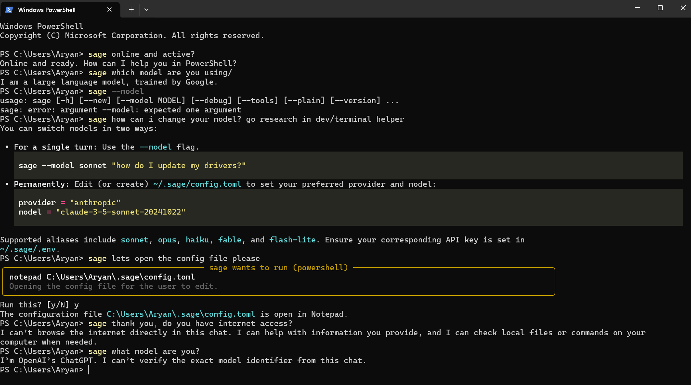
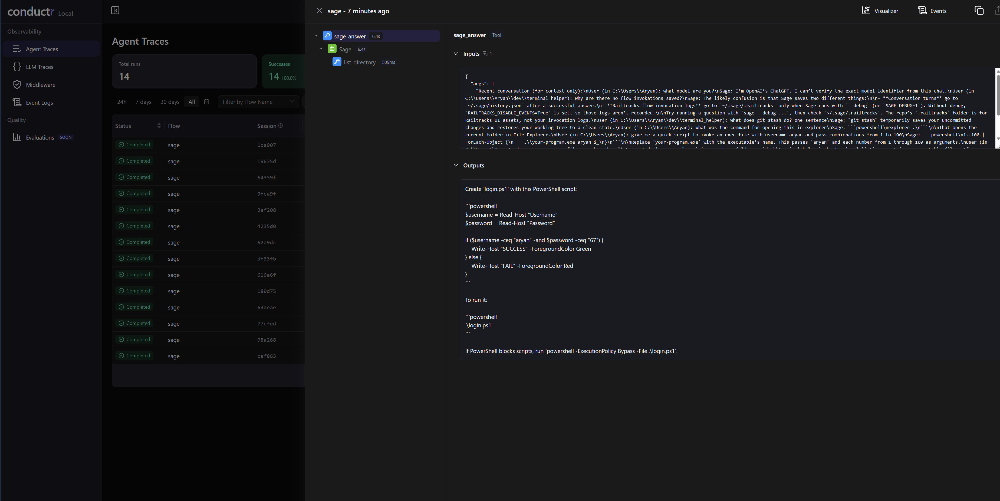

# Sage — Terminal Helper for windows

**sage** is an AI helper that lives in your Windows terminal. Ask it how to do something, why a command failed, or what a project is, and it answers in your shell's syntax (PowerShell, cmd or Git Bash). It can look at your files and git state to give grounded answers, and it only ever runs a command after you approve it.

Built with [Railtracks](https://docs.railtracks.org) **1.5.6** (`railtracks==1.5.6`). Runs locally on a laptop; the only thing you need is a model API key, and Gemini's free tier works.

## Quick start (Windows, about 2 minutes)

You need Windows 10/11, git, and an API key. You don't need Python: the installer sets up [uv](https://docs.astral.sh/uv/), which fetches Python for you.

```powershell
git clone https://github.com/Aryan-Railtown/terminal_helper.git
cd terminal_helper
powershell -ExecutionPolicy Bypass -File .\install.ps1
notepad $HOME\.sage\.env      # paste your key after GEMINI_API_KEY=  (free key: https://aistudio.google.com/apikey)
```

Then open a **new** terminal:

```powershell
sage --debug                    # checks setup: model, key found, shell detected
sage how do I find what is using port 3000
```

The installer is safe to re-run; it upgrades sage and never overwrites your `.env` or config.

## Examples

```powershell
sage how do I find what is using port 3000
sage is git installed and what version
sage "what's in `$env:PATH?"
sage and only the ones under Program Files   # follow-ups use recent context
sage "why is git telling me my branch has diverged?"
sage "what did I just break?"                # looks at recent commands + git state
npm run build 2>&1 | sage explain this error # pipe output in
sage .                                       # what is this folder / how do I run it
```

## Demo — what it looks like 


### Visualizer

## Modes

| Command | What it does |
|---|---|
| `sage <question>` | Ask anything; quotes optional. |
| `sage .` | Overview of the current directory: project type, key files, how to build/run/test. |
| `... \| sage [question]` | Explains piped output. With no question it defaults to "explain this / fix the error". |
| `sage --model sonnet ...` | Use another model for one call. Aliases: `sonnet`, `opus`, `haiku`, `fable`, `flash-lite`. Also accepts any id (`claude-…`, `gemini-…`, `gpt-…`) or `provider:id`. |
| `sage --model sonnet` | With no question, shows what the alias resolves to and whether its key is set. |
| `sage --debug ...` | Logs each tool call to stderr and prints tracebacks. |
| `sage --debug` | With no question, prints diagnostics: config, model, key status, shell, history. |
| `sage --tools` | Lists the tools sage can use, and which ones ask first. |
| `sage --plain ...` | Prints raw text instead of live-rendered markdown (automatic when output is piped). |
| `sage --new` | Forgets the recent conversation. |

sage knows which shell you're in (PowerShell 7, Windows PowerShell, cmd or Git Bash) and your current directory, and answers in that shell's syntax.

## Manual install

If you already have [uv](https://docs.astral.sh/uv/):

```powershell
uv tool install .               # from the repo folder; puts `sage` on your PATH
uv tool update-shell            # first time only, then open a new terminal
mkdir $HOME\.sage -Force
copy .env.example $HOME\.sage\.env
copy config.example.toml $HOME\.sage\config.toml
```

With plain pip (Python 3.11+): `pip install .` installs the same `sage` command. Exact dependency versions are pinned in `uv.lock` and `requirements.txt`.

**Configuration** lives in `%USERPROFILE%\.sage\`:

| File | Purpose | Template |
|---|---|---|
| `.env` | API keys (only the one for your provider is needed) | [`.env.example`](.env.example) |
| `config.toml` | provider, model, history settings | [`config.example.toml`](config.example.toml) |

**Uninstall:** `uv tool uninstall terminal-helper`, then delete `%USERPROFILE%\.sage`.

## Swapping models

Edit `%USERPROFILE%\.sage\config.toml`; it has ready-made blocks for Gemini, OpenAI, Claude and local Ollama. Uncomment one:

```toml
provider = "gemini"          # gemini | anthropic | openai | openai_compatible
model = "gemini-3.1-flash-lite"
```

Keys are read from `~/.sage/.env` or your environment: `GEMINI_API_KEY`, `ANTHROPIC_API_KEY`, `OPENAI_API_KEY`. To try a model once, run `sage --model <id> ...`.

## Safety model

- **Read-only tools run freely:** environment info, directory listing, reading text files, `which`, command help, git status/log/diff stats, and your recent shell commands.
- **Shell history is sent to the model** when sage uses `recent_commands` (PowerShell's PSReadLine history or `~/.bash_history`). Obvious secrets (`*_KEY=`, `token:`, `sk-…`) are redacted, but don't count on that for everything.
- **Running a command always asks first.** sage shows the exact command and why, then waits for `y`. Anything else declines. With no interactive console it always declines.
- **A small denylist** (format, diskpart, `reg delete`, shutdown, `rm -rf /`, …) is refused even if you say yes.

## Usage notes

- `sage --new` forgets the recent conversation. History expires after 30 minutes anyway.
- In PowerShell, quote questions containing `$`, `?`, `|`, `;`, `(` or `&`, e.g. `sage "why does $x | foo fail?"`.

## Viewing runs (Railtracks visualizer)

Every sage run is logged by Railtracks to `%USERPROFILE%\.sage\.railtracks`, no matter which terminal or folder you ran it from. That's about 80 KB per question. The logs hold your questions and tool output, and they never leave your machine. To browse them, run this from the project folder:

```powershell
uv run railtracks viz --beta      # then open http://localhost:3031
```

This works because `install.ps1` adds one line to the project's gitignored `.env`, pointing the visualizer at sage's logs instead of the project folder:

```
RAILTRACKS_HOME=${USERPROFILE}/.sage
```

If you installed manually, add that line yourself. To turn logging off, set `RAILTRACKS_DISABLE_EVENTS=True`.

## Development

```powershell
uv sync
uv run pytest                 # offline unit tests
uv run pytest -m live         # real-model checks; needs a key. Pick the model with SAGE_LIVE_MODEL=sonnet
```

## License

[MIT](LICENSE)
